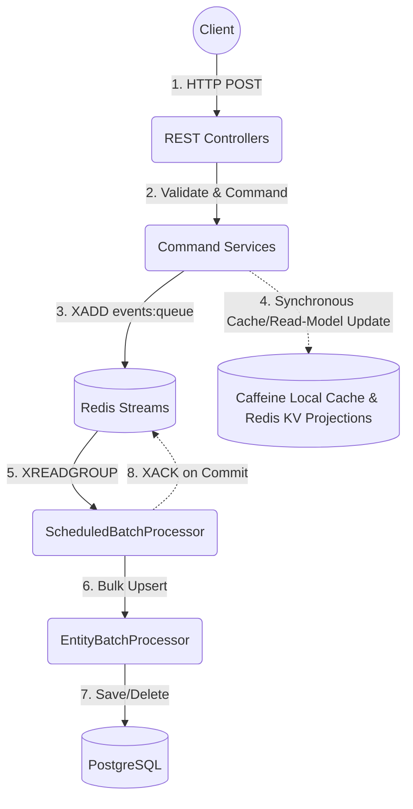

# ARCHITECTURE: High-Throughput Event-Driven CQRS

This application (`boot-high-rps-sample`) demonstrates an ultra-high-throughput, event-driven CQRS architecture. It completely decouples the synchronous HTTP command path from the relational database to achieve maximum performance and resilience.

## Core Architectural Principles

1. **No Synchronous DB Blocking**: The command path (write operations) strictly avoids writing to PostgreSQL synchronously.
2. **Redis Streams as the Immediate Ledger**: State mutations are validated and published directly to Redis Streams (`events:queue`) as the immediate durable write-behind log.
3. **Direct-To-Stream Publishing**: The application writes events directly to the Redis Stream, bypassing intermediate processing for maximum speed.
4. **At-Least-Once Materialization**: Scheduled processors read from Redis Streams (`XREADGROUP`), execute natural-key upserts against PostgreSQL in bulk, and acknowledge (`XACK`) only after the DB transaction commits.

## Architecture Data Flow

## Detailed CQRS Implementation

### Command Side (Writes)
The Command side handles state changes at thousands of RPS by bypassing the database.
- **Service Pattern**: Commands acquire distributed reservations (Redis) to prevent duplicate creation. They are executed via `AbstractCommandService.executeCommand`, which manages JSON event serialization with an `__entity` tag and executes an `XADD` to `events:queue`.
- **Local Consistency**: Once the `XADD` is successful, a synchronous `postPublishAction` invalidates the local Caffeine cache and updates the Redis materialized view for read-your-own-writes consistency.
- **In-JVM Sequencing**: `AggregateOperationQueue` acts as a per-aggregate-key in-JVM sequencer to ensure ordered processing of operations for the same aggregate, not a DB batcher.

### Write-Behind Batch Processing
The `ScheduledBatchProcessor` manages the consumer-group flow to synchronize state to PostgreSQL:
- **Consumer Group Flow**: An `@Scheduled` task drains the queue, and uses `claimPendingRecords` for handling stalled processing. 
- **Batching & Tombstones**: Events are grouped using last-write-wins semantics. Tombstone handling is managed via `DeletionMarkerHandler`.
- **Database Upsert**: The batched events are delegated to a per-entity `EntityBatchProcessor` for bulk `saveAll` or `deleteBy...In` operations. 
- **Acknowledgement & DLQ**: A successful transaction results in an `XACK`. Unrecoverable poison messages are routed to the `events:dlq` stream.

### Query Side (Reads)
The Query side serves data from highly optimized read models.
- **Layered Caching Strategy**:
  1. **Tombstone Check**: Ensures deleted entities are not incorrectly served.
  2. **Caffeine**: Ultra-fast, localized in-memory cache.
  3. **Redis**: Distributed materialized view using `@RedisHash` repositories.
  4. **PostgreSQL**: JPA fallback. Misses in faster layers will query the database and warm the faster layers on a miss.

## Fault Tolerance & Reliability Patterns

1. **Dead Letter Queues (DLQ)**: Poison messages and unrecoverable errors are routed to the `events:dlq` stream.
2. **Circuit Breakers**: `Resilience4j` `@CircuitBreaker` and `@Bulkhead("dbBatchWrites")` wrap the database batch writes to halt processing gracefully during backend degradation.
3. **Idempotency via Natural Keys**: Because operations use natural-key `upserts`, redelivery caused by a crash between the database write and the Redis `XACK` is safe, provided upserts remain strictly idempotent.
4. **Graceful Deletions**: Deletions are processed as Tombstone events, with unified logic managed by `DeletionMarkerHandler`.
5. **Strict Commit Semantics**: Redis Streams consumer-group acknowledgment (`XACK`) and pending-record claim/retry mechanisms ensure robust delivery. Manual acks are only issued *after* the durable handoff to the database.

## Observability & Configuration

- **Structured Configuration**: Type-safe Spring Boot `@ConfigurationProperties` drive parameters like `app.batch.queue-key`, `app.batch.size`, `app.batch.delay-ms`, and `app.cache.local-max-size`, making environments easily tunable.
- **MDC Propagation**: Correlation IDs are generated at the HTTP layer (`CorrelationIdFilter`) and propagated natively across thread boundaries.
- **OpenTelemetry (OTel)**: Metrics and distributed traces are seamlessly exported to a Grafana/Prometheus stack.

## Spring Modulith

The application enforces strict architectural boundaries using Spring Modulith.

- **Dependency Direction**: Module dependencies flow strictly in one direction: `postcomment → post → author`. Bidirectional JPA associations are disallowed; cross-module relationships must use identifiers and query services.
- **Shared Kernel**: The `shared` module is a pure kernel. It has no outgoing dependencies to other modules.
- **Infrastructure Supplier**: The `infrastructure` module acts as a supplier, depending only on `shared`. It provides cross-cutting concerns (Cache, Redis).
- **Module API Boundaries**: Domain modules expose specific packages via `@NamedInterface` to limit access. The only declared named interfaces are `infrastructure::cache` and `infrastructure::redis`.
- **Validation**: `ModulithStructureTest` continuously verifies these boundaries during the build via `ApplicationModules.verify()`.
